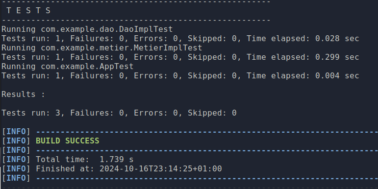

# Spring DI Project

This is a simple Spring project demonstrating dependency injection (DI) and inversion of control (IoC) with multiple implementations of a DAO interface and a service layer. The project supports environment-specific profiles for development and production and includes unit tests using JUnit and Mockito.

## Project Structure

```
src/
├── main
│   ├── java
│   └── resources
├── test
└── pom.xml
```

### Features

- Spring Dependency Injection (DI) using `@Autowired` and `@Component`.
- Multiple `IDao` implementations for different environments (dev and prod).
- Profile-based dynamic injection using `@Profile` annotations.
- Unit tests using JUnit and Mockito.
- XML-based configuration for dependency injection (optional).
  
## Prerequisites

Before you begin, ensure you have the following installed on your local machine:

- Java 11 or later
- Maven 3.x
- Spring Framework 5.x

## Getting Started

### 1. Clone the Repository

```bash
git clone https://github.com/yourusername/springdi.git
cd springdi
```

### 2. Build the Project

Use Maven to clean and build the project:

```bash
mvn clean install
```

### 3. Run the Application

To run the Spring application, open the `Presentation2.java` class and execute it using your preferred IDE or with Maven.

### 4. Set the Active Profile

You can switch between development and production profiles by modifying the `application.properties` file in `src/main/resources/`.

- **For Development** (Uses `DaoImpl`):

```properties
spring.profiles.active=dev
```

- **For Production** (Uses `DaoImpl2`):

```properties
spring.profiles.active=prod
```

### 5. Run Unit Tests

To run the unit tests:

```bash
mvn clean test
```

This will run the tests for `DaoImpl`, `MetierImpl`, and ensure that the application works as expected.

### 6. Test Success Screenshot




### 7. XML Configuration (Optional)

You can also use XML configuration for dependency injection. To switch to XML configuration, modify the `Presentation2.java` to use the `spring-config.xml` located in `src/main/resources/`.

